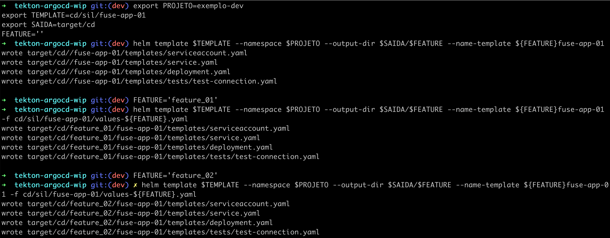
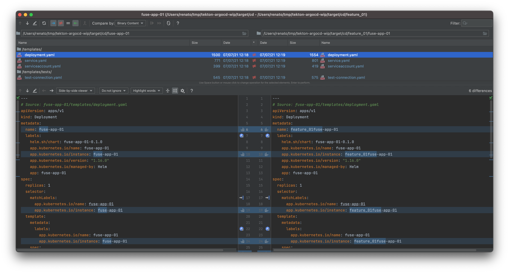
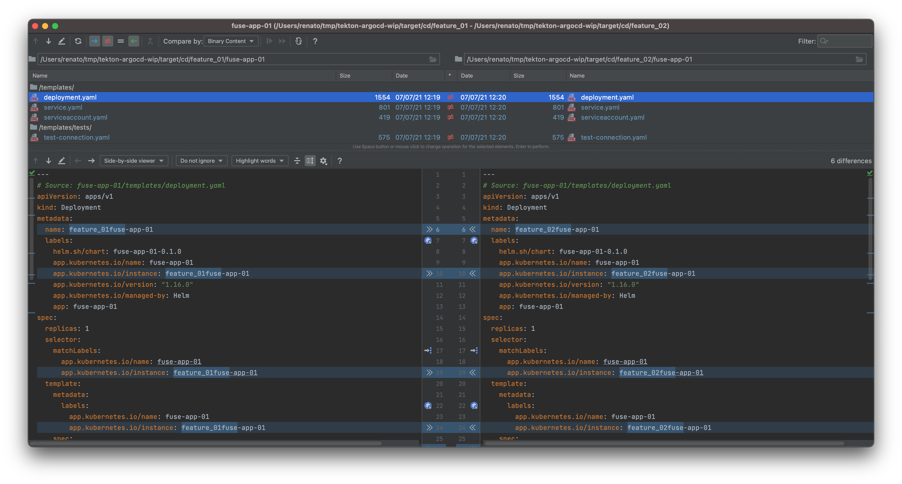

> Algumas atividades feitas usando Jenkins com Helm


## Construção dos Artefatos

> como estamos usando o Helm foi utilizado a ferramenta para gerar a estrutura inicial.

```shell
$ helm create xpto
```


## Múltiplos CICD's da mesma aplicação

> será explicado tendo como base a aplicação **fuse-app-01**

### CI

```shell
# baixar o repositório na branch do referido ambiente
$ AMBIENTE=dev
$ PROJETO=silada
$ APP_NAME=fuse-app-01
$ BRANCH_NAME=develop

$ git clone -b $AMBIENTE git@github.com:jovemfelix/gitops-jenkins-helm.git
$ VERSAO_IMAGEM = ${BRANCH_NAME}-${GIT_COMMIT_HASH}
$ TEMPLATE=${PROJETO}/${APP_NAME}/values-${BRANCH_NAME}.yaml

# atualizar o valor da variavel com a imagem gerada
$ yq eval "(.app.image.tag)|=\"$VERSAO_IMAGEM\"" -i $TEMPLATE
```


### CD

```shell
# A seguir temos o output para o caso geral, ou seja será usado "values.yaml"
$ AMBIENTE=qa
$ PROJETO=silada
$ APP_NAME=fuse-app-01
$ BRANCH_NAME=release_01

# baixar o repositório na branch do referido ambiente
$ git clone -b $AMBIENTE git@github.com:jovemfelix/gitops-jenkins-helm.git
$ TEMPLATE=${PROJETO}/${APP_NAME}

$ SAIDA=target/${PROJETO}/${BRANCH_NAME}

$ helm template $TEMPLATE --namespace $PROJETO --output-dir $SAIDA --name-template ${BRANCH_NAME}-${APP_NAME} \
  -f $TEMPLATE/values-${BRANCH_NAME}.yaml

# Agora imagina que que temos 02 equipes trabalhando com features específicas do mesmo sistema
## para 2ª release, temos:
$ FEATURE='feature_01'
$ helm template $TEMPLATE --namespace $PROJETO --output-dir $SAIDA/$FEATURE --name-template ${FEATURE}fuse-app-01 -f cd/sil/fuse-app-01/values-${FEATURE}.yaml

## para 3ª release, temos:
$ FEATURE='feature_02'
$ helm template $TEMPLATE --namespace $PROJETO --output-dir $SAIDA/$FEATURE --name-template ${FEATURE}fuse-app-01 -f cd/sil/fuse-app-01/values-${FEATURE}.yaml
```

> Resultado da execução
>
> 


> Veja a diferença a seguir a diferenças:
>
> * Do **default** (que é o correspondente ao padrão do ambiente) ***VS*** **feature_01**
>
> 
>
> Do **default** (que é o correspondente ao padrão do ambiente) ***VS*** **feature_02**
>
> 
>
> * Da **feature_01** ***VS*** **feature_02**
>
> 
>
> Conclusão teremos distintos **deployments** para a "mesma" aplicação.


## Ferramentas e Versões usadas

```shell
$ helm version
version.BuildInfo{Version:"v3.6.0", GitCommit:"7f2df6467771a75f5646b7f12afb408590ed1755", GitTreeState:"dirty", GoVersion:"go1.16.4"}
```
