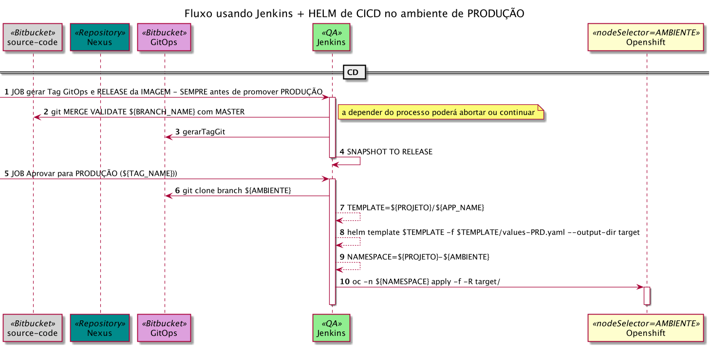
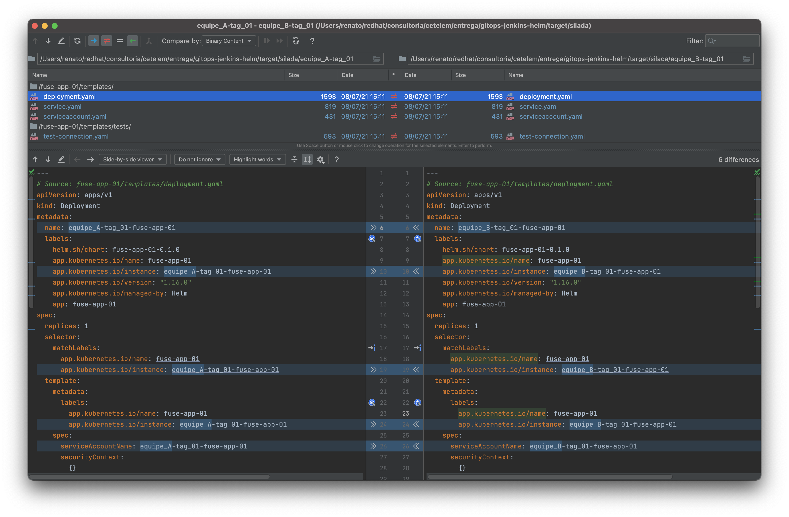

> Algumas atividades feitas usando Jenkins com Helm


## Construção dos Artefatos

> como estamos usando o Helm foi utilizado a ferramenta para gerar a estrutura inicial.

```shell
$ helm create xpto
```


## Visão Geral




# Múltiplos CICD's da mesma aplicação

> será explicado tendo como base a aplicação **fuse-app-01**


## Exemplo do Fluxo de Demanda por Equipe

> Visão do Fluxo para **<u>PRD</u>**

### Equipe A

#### CD

```shell
## baixar o repositório na branch do referido ambiente
$ AMBIENTE=prd
$ git clone -b $AMBIENTE git@github.com:jovemfelix/gitops-jenkins-helm.git
$ cd gitops-jenkins-helm

$ PROJETO=silada
$ APP_NAME=fuse-app-01
## Aqui temos a demanda específica da equipe!
$ BRANCH_NAME=equipe_A-tag_01
$ TEMPLATE_DIR=${PROJETO}/${APP_NAME}
$ TEMPLATE_VALUES=${TEMPLATE_DIR}/values-${BRANCH_NAME}.yaml

## gerar os artefatos de deploy
$ SAIDA=target/${PROJETO}/${BRANCH_NAME}
$ helm template $TEMPLATE_DIR --namespace $PROJETO --output-dir $SAIDA --name-template ${BRANCH_NAME}-${APP_NAME} -f ${TEMPLATE_VALUES}
```


#### Resultado da execução

> ```shell
> ################################# CI :: Equipe A
> ➜  gitops-jenkins-helm git:(prd) ✗ AMBIENTE=prd
> ➜  gitops-jenkins-helm git:(prd) ✗ PROJETO=silada
> ➜  gitops-jenkins-helm git:(prd) ✗ APP_NAME=fuse-app-01
> ➜  gitops-jenkins-helm git:(prd) ✗ BRANCH_NAME=equipe_A-tag_01
> ➜  gitops-jenkins-helm git:(prd) ✗ TEMPLATE_DIR=${PROJETO}/${APP_NAME}
> ➜  gitops-jenkins-helm git:(prd) ✗ TEMPLATE_VALUES=${TEMPLATE_DIR}/values-${BRANCH_NAME}.yaml
> ➜  gitops-jenkins-helm git:(prd) ✗ GIT_COMMIT_HASH=$(openssl rand -hex 4)
> ➜  gitops-jenkins-helm git:(prd) ✗ VERSAO_IMAGEM=${BRANCH_NAME}-${GIT_COMMIT_HASH}
> ################################# Atualizar a versão da image e prefixo a ser usado
> ➜  gitops-jenkins-helm git:(prd) ✗ yq eval "(.app.image.tag)|=\"$VERSAO_IMAGEM\" | (.app.namePrefix)|=\"$BRANCH_NAME\"" -n > $TEMPLATE_VALUES
> ➜  gitops-jenkins-helm git:(prd) ✗ bat $TEMPLATE_VALUES
> ───────┬──────────────────────────────────────────────────────────────
>        │ File: silada/fuse-app-01/values-equipe_A-tag_01.yaml
> ───────┼──────────────────────────────────────────────────────────────
>    1   │ app:
>    2   │   image:
>    3   │     tag: equipe_B-tag_01-a6b514ea
>    4   │   namePrefix: equipe_B-tag_01
> ───────┴──────────────────────────────────────────────────────────────
> 
> ################################# CD :: Equipe A
> ➜  gitops-jenkins-helm git:(prd) ✗ SAIDA=target/${PROJETO}/${BRANCH_NAME}
> 
> ➜  gitops-jenkins-helm git:(prd) ✗ helm template $TEMPLATE_DIR --namespace $PROJETO --output-dir $SAIDA --name-template ${BRANCH_NAME}-${APP_NAME} -f ${TEMPLATE_VALUES}
> wrote target/silada/equipe_A-tag_01/fuse-app-01/templates/serviceaccount.yaml
> wrote target/silada/equipe_A-tag_01/fuse-app-01/templates/service.yaml
> wrote target/silada/equipe_A-tag_01/fuse-app-01/templates/deployment.yaml
> wrote target/silada/equipe_A-tag_01/fuse-app-01/templates/tests/test-connection.yaml
> ```

### Equipe B

#### CD

```shell
## baixar o repositório na branch do referido ambiente
$ AMBIENTE=prd
$ git clone -b $AMBIENTE git@github.com:jovemfelix/gitops-jenkins-helm.git
$ cd gitops-jenkins-helm

$ PROJETO=silada
$ APP_NAME=fuse-app-01
## Aqui temos a demanda específica da equipe!
$ BRANCH_NAME=equipe_B-tag_01
$ TEMPLATE_DIR=${PROJETO}/${APP_NAME}
$ TEMPLATE_VALUES=${TEMPLATE_DIR}/values-${BRANCH_NAME}.yaml

## gerar os artefatos de deploy
$ SAIDA=target/${PROJETO}/${BRANCH_NAME}
$ helm template $TEMPLATE_DIR --namespace $PROJETO --output-dir $SAIDA --name-template ${BRANCH_NAME}-${APP_NAME} -f ${TEMPLATE_VALUES}
```

#### Resultado da execução

> ```shell
> ################################# CI :: Equipe B
> ➜  gitops-jenkins-helm git:(prd) ✗ AMBIENTE=prd
> ➜  gitops-jenkins-helm git:(prd) ✗ PROJETO=silada
> ➜  gitops-jenkins-helm git:(prd) ✗ APP_NAME=fuse-app-01
> ➜  gitops-jenkins-helm git:(prd) ✗ BRANCH_NAME=equipe_B-tag_01
> ➜  gitops-jenkins-helm git:(prd) ✗ TEMPLATE_DIR=${PROJETO}/${APP_NAME}
> ➜  gitops-jenkins-helm git:(prd) ✗ TEMPLATE_VALUES=${TEMPLATE_DIR}/values-${BRANCH_NAME}.yaml
> ➜  gitops-jenkins-helm git:(prd) ✗ GIT_COMMIT_HASH=$(openssl rand -hex 4)
> ➜  gitops-jenkins-helm git:(prd) ✗ VERSAO_IMAGEM=${BRANCH_NAME}-${GIT_COMMIT_HASH}
> ################################# Atualizar a versão da image e prefixo a ser usado
> ➜  gitops-jenkins-helm git:(prd) ✗ yq eval "(.app.image.tag)|=\"$VERSAO_IMAGEM\" | (.app.namePrefix)|=\"$BRANCH_NAME\"" -n > $TEMPLATE_VALUES
> ➜  gitops-jenkins-helm git:(prd) ✗ bat $TEMPLATE_VALUES
> ───────┬──────────────────────────────────────────────────────────────
>        │ File: silada/fuse-app-01/values-equipe_B-tag_01.yaml
> ───────┼──────────────────────────────────────────────────────────────
>    1   │ app:
>    2   │   image:
>    3   │     tag: equipe_A-tag_01-85a3eea3
>    4   │   namePrefix: equipe_A-tag_01
> ───────┴──────────────────────────────────────────────────────────────
> 
> ################################# CD :: Equipe B
> 
> ➜  gitops-jenkins-helm git:(prd) ✗ SAIDA=target/${PROJETO}/${BRANCH_NAME}
> 
> ➜  gitops-jenkins-helm git:(prd) ✗ helm template $TEMPLATE_DIR --namespace $PROJETO --output-dir $SAIDA --name-template ${BRANCH_NAME}-${APP_NAME} -f ${TEMPLATE_VALUES}
> wrote target/silada/equipe_B-tag_01/fuse-app-01/templates/serviceaccount.yaml
> wrote target/silada/equipe_B-tag_01/fuse-app-01/templates/service.yaml
> wrote target/silada/equipe_B-tag_01/fuse-app-01/templates/deployment.yaml
> wrote target/silada/equipe_B-tag_01/fuse-app-01/templates/tests/test-connection.yaml
> ```


### Diferença do Deployment entre as Equipes



```diff
diff target/silada/equipe_A-tag_01/fuse-app-01/templates/deployment.yaml target/silada/equipe_B-tag_01/fuse-app-01/templates/deployment.yaml
6c6
<   name: equipe_A-tag_01-fuse-app-01
---
>   name: equipe_B-tag_01-fuse-app-01
10c10
<     app.kubernetes.io/instance: equipe_A-tag_01-fuse-app-01
---
>     app.kubernetes.io/instance: equipe_B-tag_01-fuse-app-01
19c19
<       app.kubernetes.io/instance: equipe_A-tag_01-fuse-app-01
---
>       app.kubernetes.io/instance: equipe_B-tag_01-fuse-app-01
24c24
<         app.kubernetes.io/instance: equipe_A-tag_01-fuse-app-01
---
>         app.kubernetes.io/instance: equipe_B-tag_01-fuse-app-01
26c26
<       serviceAccountName: equipe_A-tag_01-fuse-app-01
---
>       serviceAccountName: equipe_B-tag_01-fuse-app-01
33c33
<           image: "nexus-registry-rfelix-cicd.apps.tim.rhbr-lab.com/silada/fuse-app-01:equipe_A-tag_01-85a3eea3"
---
>           image: "nexus-registry-rfelix-cicd.apps.tim.rhbr-lab.com/silada/fuse-app-01:equipe_B-tag_01-a6b514ea"
```


## Ferramentas e Versões usadas

```shell
$ helm version
version.BuildInfo{Version:"v3.6.0", GitCommit:"7f2df6467771a75f5646b7f12afb408590ed1755", GitTreeState:"dirty", GoVersion:"go1.16.4"}
```
